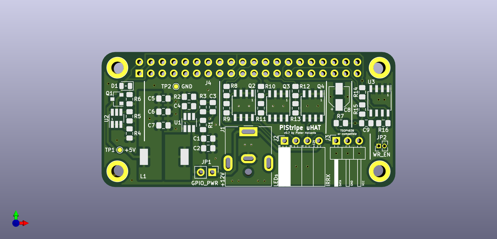

# PiStripe uHAT

## Hardware

The current v0.7 revision of the PiStripe uHAT has been successfully built and tested with the following remarks nonwithstanding:
- the pullups R9, R11 and R13 are probably unnecessary if the ID EEPROM is changed to use the Raspberry Pi's internal pull-up resistors.
- I used a bit of a too small font size, so if you can't read everything, it's not your eyes...

### GPIOs used

The PiStripe uHAT uses the following GPIO pins:

|          GPIO pins           |    Pin name     |            Usage           | Exclusive |
| :--------------------------: | :-------------: | :------------------------: | :-------: |
|              1, 17           |      +3.3V      |   IR receiver, ID EEPROM   |    No     |
|              2, 4            |       +5V       | Back powering Raspberry Pi |    No     |
| 6, 9, 14, 20, 25, 30, 34, 39 |       GND       |           Ground           |    No     |
|               19             | GPIO10_SPI_MOSI |   LED color 1 (e.g. Red)   |    Yes    |
|               21             | GPIO09_SPI_MISO |  LED color 2 (e.g. Green)  |    Yes    |
|               22             |      GPIO25     |      IR receiver data      |    Yes    |
|               23             | GPIO11_SPI_CLK  |   LED color 3 (e.g. Blue)  |    Yes    |
|               27             |      ID_SD      |     ID EEPROM I2C Data     |    No     |
|               28             |      ID_SC      |     ID EEPROM I2C Clock    |    No     |

### Jumpers

There are two jumpers:

| Jumper |   Name   |                        Function                        |
| :----: | :------: | :----------------------------------------------------: |
|  JP1   | GPIO_PWR | Open: Raspberry Pi is powered over Micro USB connector |
|        | GPIO_PWR | Closed: Enable back powering the Raspberry Pi via GPIO |
|  JP2   |   WR_EN  |                   Open: Normal usage                   |
|        |   WR_EN  |           Closed: ID EEPROM can be programmed          |

Whether you leave JP1 open or closed depends on whether you want to use the "back powering" feature, thus requiring only the LED stripe's +12V power supply, or keep supplying the Raspberry Pi via its Micro USB connector. Even if you accidentally close JP1 and still connect power to the Pi's Micro USB connector, nothing should go wrong thanks to the "perfect" reverse current blocking diode.

JP2 should only be closed once to program the ID EEPROM (no instructions and software for this yet) and stay open afterwards to prevent accidental flashing.

### Design files

The board's schematic and PCB have been designed with [KiCad](http://www.kicad-pcb.org), a really powerful Open Source EDA solution and a worthy alternative to commercial products such as Eagle.

#### Schematic

Here's an image of the schematic:

As you can see, the schematic is clearly divided into different blocks that corrospond to the functions listed above, so comparisons with the original sources for the schematics (see [Credits](#credits)) should be rather easy.

#### PCB

Here are some images of the PCB:

Like the schematic, the PCB has guiding lines printed on top to isolate the different function blocks.

#### Parts list

Please consult the [CSV part list](Hardware/PiStripe_uHAT_Parts.csv) for details.

### Credits

I'm not really inventing something new here but merely combining existing stuff into something new, so I'm standing on the shoulders of giants and try to give appropriate credits here. A big "Thank you" to the following people:

- **Alain Pannetrat** posted the Texas Instruments' [TPS54202](http://www.ti.com/lit/ds/symlink/tps54202.pdf)-based schematic and PCB for [Adding a DC power jack to the Raspberry Pi](https://www.omzlo.com/articles/adding-a-dc-power-jack-to-the-raspberry-pi-v2) on his omzlo.com blog. He did not explicitly specify a license, so I'll assume CC-BY-SA.
- **The Raspberry Foundation** published the circuit for the "perfect" reverse current blocking diode in their [Add-On board / HAT design guide](https://github.com/raspberrypi/hats/blob/master/designguide.md) (see the section "Back Powering the Pi via the GPIO Header" there and the [ZVD circuit schematic](https://github.com/raspberrypi/hats/blob/master/zvd-circuit.png).
- **Leon Anavi** published the schematic and PCB for his [ANAVI Light pHAT](https://www.crowdsupply.com/anavi-technology/light-phat) and his [ANAVI Infrared pHAT](https://www.crowdsupply.com/anavi-technology/infrared-phat) under the [CC-BY-SA 4.0](https://creativecommons.org/licenses/by-sa/4.0/) license. The LED driving circuit, the IR receiver circuit and the basic PCB design such as board dimensions, mounting holes etc. are based on his work. Note that for the IR receiver I use pin 22 (GPI25) instead of pin 12 (GPIO18) to be compatible with the [pHAT DAC](https://de.pinout.xyz/pinout/phat_dac).
- **Mike Lawrence** posted a [RPi_Zero_pHat_Template](https://github.com/mikelawrence/RPi_Zero_pHat_Template) from which I used symbols in ``Connector-ML.lib`` for the schematic. The template is licensed under the [MIT license](https://github.com/mikelawrence/RPi_Zero_pHat_Template/blob/master/LICENSE).
- **Digikey** provides a [KiCAD library](https://github.com/digikey/digikey-kicad-library) from which I used symbols in ``dk_Transistors-FETs-MOSFETs-Single.lib`` for the schematic. The library is licensed under the [CC-BY-SA 4.0](https://github.com/digikey/digikey-kicad-library/blob/master/LICENSE.md) license.
- **L. Bernstone** posted the schematic and design for a [3V3 DC/DC power supply layout using TPS54202](https://github.com/lbernstone/TPS54202/) from which I used symbols in ``tps54202.lib`` for the schematic.
- **Tinkerforge** provides [KiCAD libraries](https://github.com/Tinkerforge/kicad-libraries) from which I used symbols in ``DMMT5401.lib`` for the schematic. They are licensed under the [CERN Open Hardware License v1.1](https://github.com/Tinkerforge/kicad-libraries/blob/master/LICENSE.txt).
- **Philipp "Virtex7" Hörauf** provides a [Philipps Kicad Bauteile collection](https://github.com/Virtex7/PhilippsKicadBauteile/) from which I used the footprint ``SRU1048.kicad_mod`` in the PCB design. Since it didn't provide a 3D model, I modified it to use the one from the following paragraph. Philipp did not explicitly specify a license, so I'll assume CC-BY-SA.
- **ACSE & CADIEEL** provide [CIAA Hardware repository](https://github.com/ciaa/Hardware) from which I used the 3D model ``SRU1048.wrl`` together with the footprint in the previous paragraph. They use [their own license](https://github.com/ciaa/Hardware/blob/master/LICENSE).

### LICENSE

The PiStripe uHAT PCB and its design files are licensed [LICENSE](CC-BY-SA).
