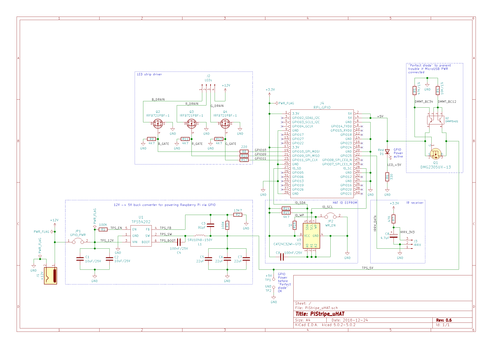
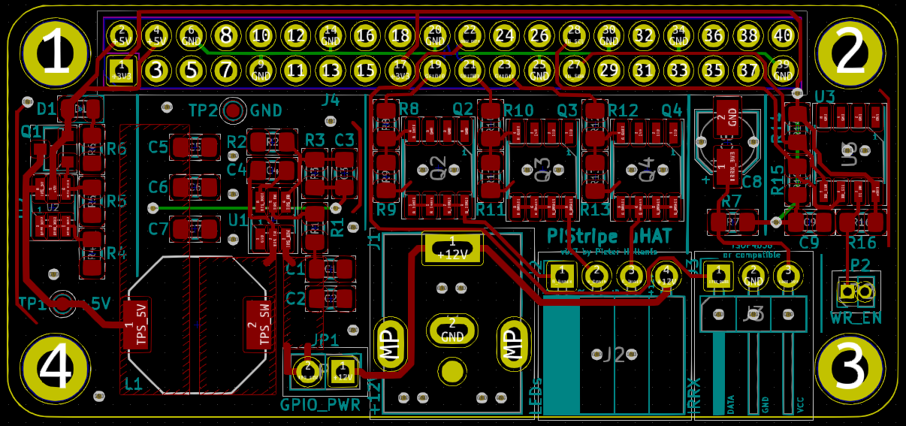
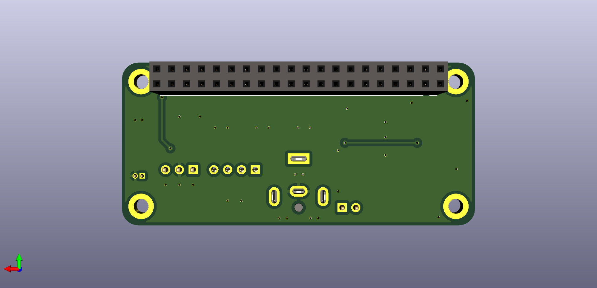

# PiStripe uHAT

## WARNING

The schematic needs a review and the PCB has been neither built nor tested yet. Any usage is at your own risk.

## Background

Surely I'm not the only one having both a Raspberry Pi and an LED stripe flying around. In my case it was a "dumb", analogue 12V RGB LED stripe, meaning an LED strip without individually addressable LEDs - instead you generate different colors on the entire LED stripe by using pulse width modulation (PWM) on the R, G and B lines.

Interestingly, while there are plenty of tutorials on connecting such an LED stripe to the Raspberry Pi using transistors I wasn't able to find a ready-to-use HAT doing this. There are plenty of HATs driving LEDs directly mounted on the HAT (e.g. [Pimoroni's Ubercorn](https://shop.pimoroni.com/products/ubercorn) and [Unicorn](https://shop.pimoroni.com/products/unicorn-hat) HATs) and
there is [ManiacalLabs' PiPixel HAT](https://www.tindie.com/products/ManiacalLabs/pipixel-raspberry-pi-led-strip-hat/) but that one drives "digital" WS2812-based LED strips, not dumb ones such as mine. Knight of Pi simply [soldered the transistors on Adafruit's ProtoHAT](http://www.knight-of-pi.org/color-mixer-control-a-rgb-led-strip-with-the-raspberry-pi-and-the-n-channel-mosfet-irlb8721/)
but that seemed to me a bit too hackish for permanent use.

The closest existing solution is the [ANAVI Light pHAT](https://www.crowdsupply.com/anavi-technology/light-phat). It is designed for 12V RGB LED strips such as mine, however there were some points I didn't like. For instance, it uses a quite big screw terminal
where I'd prefer a more compact pin header that matches the existing LED strip connector. But most of all, I don't like having to use two power supplies, one with 12V for the LED strip and still one with 5V for the Raspberry Pi. Unfortunately, with the ANAVI pHAT, it was decided to not implement the back powering option, i.e. integrating a switching regular to convert 12V to 5V and supply these to the Raspberry Pi via the GPIO pins. Instead the PCB space was used for various options for all kinds of sensors,
something I don't really need.

So I thought, inspite of being not literate at electronics enough I'd build something myself and take the best parts and features of existing solutions (see [Credits](#credits)) and combine them into a HAT of my own. After all, that's what open hardware is all about!

## Features

The PiStripe uHAT is a board of the size of the Raspberry Pi Zero, thus a uHAT (not a HAT) as defined by the Raspberry Foundation. It can be attached on any Raspberry Pi with the 40 pin connector, not just the Pi Zero (W).

The uHAT features the following five functions:

- a 12V -> 5V buck converter based on Texas Instruments' [TPS54202](http://www.ti.com/lit/ds/symlink/tps54202.pdf) chip to implement "back powering" the Raspberry Pi via the GPIO pins, doing away with the need to use two power supplies (one 12V for the LED strip, one 5V for the Raspberry Pi).
- a "perfect" reverse current blocking diode schematic as described in the
  [Raspberry Foundation Add-On board / HAT design guide](https://github.com/raspberrypi/hats/blob/master/designguide.md) to prevent damage when accidentally connecting both 5V to the RPi via its MicroUSB connector and supplying power via my HAT does
  not cause damage.
- the actual LED strip driving
- the possibility to connect an external IR receiver such as a TSOP 34838 so you can use [LIRC](http://lirc.org/) to decode the signals sent by the LED strip's original remote control. External because the HAT is mounted on the Raspberry Pi which in turn will probably be hidden away in some corner whereas you will want to place the IR receiver at a place where it can actually "see" the remote control.
- an ID EEPROM so the board qualifies officially as a HAT as described in the [Raspberry Foundation Add-On board / HAT design guide](https://github.com/raspberrypi/hats/blob/master/designguide.md).

## Hardware

### GPIOs used

The PiStripe uHAT uses the following GPIO pins:

|          GPIO pins           |    Pin name     |            Usage           | Exclusive |
| :--------------------------: | :-------------: | :------------------------: | :-------: |
|              1, 17           |      +3.3V      |   IR receiver, ID EEPROM   |    No     |
|              2, 4            |       +5V       | Back powering Raspberry Pi |    No     |
| 6, 9, 14, 20, 25, 30, 34, 39 |       GND       |           Ground           |    No     |
|               19             | GPIO10_SPI_MOSI |   LED color 1 (e.g. Red)   |    Yes    |
|               21             | GPIO09_SPI_MISO |  LED color 2 (e.g. Green)  |    Yes    |
|               22             |      GPIO25     |      IR receiver data      |    Yes    |
|               23             | GPIO11_SPI_CLK  |   LED color 3 (e.g. Blue)  |    Yes    |
|               27             |      ID_SD      |     ID EEPROM I2C Data     |    No     |
|               28             |      ID_SC      |     ID EEPROM I2C Clock    |    No     |

### Jumpers

There are two jumpers:

| Jumper |   Name   |                        Function                        |
| :----: | :------: | :----------------------------------------------------: |
|  JP1   | GPIO_PWR | Open: Raspberry Pi is powered over Micro USB connector |
|        | GPIO_PWR | Closed: Enable back powering the Raspberry Pi via GPIO |
|  JP2   |   WR_EN  |                   Open: Normal usage                   |
|        |   WR_EN  |           Closed: ID EEPROM can be programmed          |

Whether you leave JP1 open or closed depends on whether you want to use the "back powering" feature, thus requiring only the LED stripe's +12V power supply, or keep supplying the Raspberry Pi via its Micro USB connector. Even if you accidentally close JP1 and still connect power to the Pi's Micro USB connector, nothing should go wrong thanks to the "perfect" reverse current blocking diode.

JP2 should only be closed once to program the ID EEPROM (no instructions and software for this yet) and stay open afterwards to prevent accidental flashing.

### Design files

The board's schematic and PCB have been designed with [KiCad](http://www.kicad-pcb.org), a really powerful Open Source EDA solution and a worthy alternative to commercial products such as Eagle. All project files can be found in the [Hardware](Hardware/) folder.

#### Schematic

Here's an image of the schematic:

As you can see, the schematic is clearly divided into different blocks that corrospond to the functions listed above, so comparisons with the original sources for the schematics (see [Credits](#credits)) should be rather easy.

#### PCB

Here are some images of the PCB:

Like the schematic, the PCB has guiding lines printed on top to isolate the different function blocks.

## Software

### LIRC

I've included a [LIRC](http://www.lirc.org) configuration file for and a photo of the particular remote control my LED stripe uses in the ``Software/LIRC`` directory. Note that at least with the LIRC 0.9.4c-9 version on the 2018-11-13 Raspbian 9 (Stretch) release I used, ``irrecord`` was erroneously recording a repeat code so ``irw`` didn't show any keys. If you generate a config yourself and ``irrecord`` generates a second column that is the same for all keys, try omitting these values, that worked for me.

## Credits

As mentioned, I'm not really inventing something new here but combining different existing parts, so I'm standing on the shoulders of giants here and try to give appropriate credits to all the fine people on whose work I'm building. A big "Thank you" to the following people:

- **Alain Pannetrat** posted the Texas Instruments' [TPS54202](http://www.ti.com/lit/ds/symlink/tps54202.pdf)-based schematic and PCB for [Adding a DC power jack to the Raspberry Pi](https://www.omzlo.com/articles/adding-a-dc-power-jack-to-the-raspberry-pi-v2) on his omzlo.com blog. He did not explicitly specify a license, so I'll assume CC-BY-SA.
- **The Raspberry Foundation** published the circuit for the "perfect" reverse current blocking diode in their [Add-On board / HAT design guide](https://github.com/raspberrypi/hats/blob/master/designguide.md) (see the section "Back Powering the Pi via the GPIO Header" there and the [ZVD circuit schematic](https://github.com/raspberrypi/hats/blob/master/zvd-circuit.png).
- **Leon Anavi** published the schematic and PCB for his [ANAVI Light pHAT](https://www.crowdsupply.com/anavi-technology/light-phat) and his [ANAVI Infrared pHAT](https://www.crowdsupply.com/anavi-technology/infrared-phat) under the [CC-BY-SA 4.0](https://creativecommons.org/licenses/by-sa/4.0/) license. The LED driving circuit, the IR receiver circuit and the basic PCB design such as board dimensions, mounting holes etc. are based on his work. Note that for the IR receiver I use pin 22 (GPI25) instead of pin 12 (GPIO18) to be compatible with the [pHAT DAC](https://de.pinout.xyz/pinout/phat_dac).
- **Mike Lawrence** posted a [RPi_Zero_pHat_Template](https://github.com/mikelawrence/RPi_Zero_pHat_Template) from which I used symbols in ``Connector-ML.lib`` for the schematic. The template is licensed under the [MIT license](https://github.com/mikelawrence/RPi_Zero_pHat_Template/blob/master/LICENSE).
- **Digikey** provides a [KiCAD library](https://github.com/digikey/digikey-kicad-library) from which I used symbols in ``dk_Transistors-FETs-MOSFETs-Single.lib`` for the schematic. The library is licensed under the [CC-BY-SA 4.0](https://github.com/digikey/digikey-kicad-library/blob/master/LICENSE.md) license.
- **L. Bernstone** posted the schematic and design for a [3V3 DC/DC power supply layout using TPS54202](https://github.com/lbernstone/TPS54202/) from which I used symbols in ``tps54202.lib`` for the schematic.
- **Tinkerforge** provides [KiCAD libraries](https://github.com/Tinkerforge/kicad-libraries) from which I used symbols in ``DMMT5401.lib`` for the schematic. They are licensed under the [CERN Open Hardware License v1.1](https://github.com/Tinkerforge/kicad-libraries/blob/master/LICENSE.txt).
- **Philipp "Virtex7" Hörauf** provides a [Philipps Kicad Bauteile collection](https://github.com/Virtex7/PhilippsKicadBauteile/) from which I used the footprint ``SRU1048.kicad_mod`` in the PCB design. Since it didn't provide a 3D model, I modified it to use the one from the following paragraph. Philipp did not explicitly specify a license, so I'll assume CC-BY-SA.
- **ACSE & CADIEEL** provide [CIAA Hardware repository](https://github.com/ciaa/Hardware) from which I used the 3D model ``SRU1048.wrl`` together with the footprint in the previous paragraph. They use [their own license](https://github.com/ciaa/Hardware/blob/master/LICENSE).
